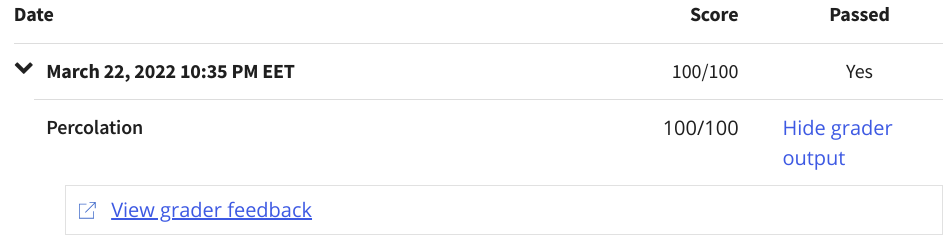
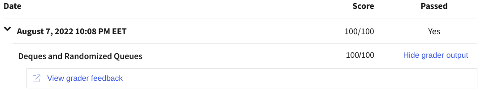
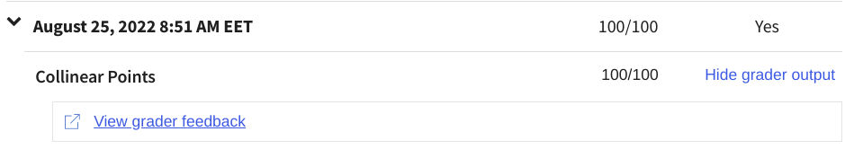
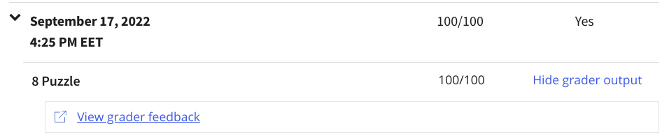
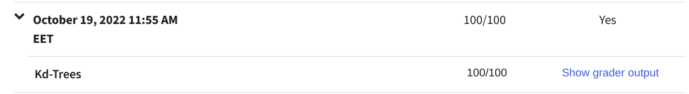
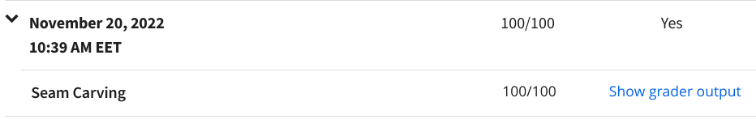
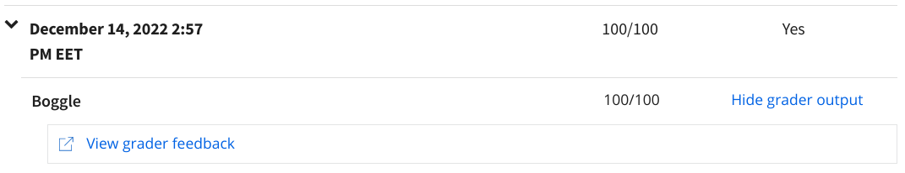
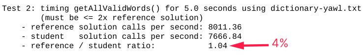

# What is the course about?

Simply, about learning various datastructure and algorithms that will be used to reducing the problems into a set of procedures/problems that we know a solution for it hence we can practically implement the best algorithm for the stated problem of every weeks' assignment.

The difference between knowing an algorithm and not knowing it is the difference between the ability to solve a problem or not solve it at all! (Robert Sedgewick).

For example, consider assignment "Collinear" below:
1. You learn sorting and search (insertion sort, shell sort,... mergesort, quicksort).
2. And, you learn the best algorithm for linear datastructures and learn why & when to use each.
3. Then you are required to solve a problem that one of its requirements is sorting in a linearithmic time.
4. You implement the problem and write your own pre-tests.
5. You test your code against provided pre-written tests
6. And finally, test it via autograder (to provide validity and test style via checkstyle and so on).
7. Solve occuring bugs at each testing stage  until you get 100% which means you fully understand the subject.

Compared to other available courses out there (especially Stanford, MIT & UC Sandiego):
1. This course has an autograder.
2. Isn't just theoretical like all other courses, and not just about "problem solving", but instead it is also about practical problems; Assignments aren't a regular problems to solve but rather building an API.
3. Supported/Backed up by a book (Prof. Robert has written an algorithms & DS book).
4. Content provided quality is always the same, the greatest (each and every lecture is the best explained all over the internet in my opinion).
5. Lecturer (Prof. Robert Sedgewick) has been teaching this course since the 90's which made him master the topic; the content of the course has been heavily revised and updated to be kept concise and clear for nearly 30 years.

Bottom line is, course is heavily revised, covers theoretical, problem solving & practical aspects of algorithms and DS, Every assignment is a project of itself... not just a 30 line problem solving question.

# Percolation

This is the first Homework; It is about utilizing Union Find Algorithm & Weighted Quick Find in specific. We use the algorithm to calculate numerically the probability *p* that can make a system percolate (any top cell connected to any bottom cell); We are required to proof the claim that $p\approx 0.5931$ and the homework does exactly that. The percolation symbolisis a lot of real world applications such as insulating material in a conducting material (or vise versa) or finding a connection between two persons in a large social network and so on.

Grade: 100/100

 

# Queues

The goal of this assignment is to implement elementary data structures using arrays and linked lists, and to introduce usage of generics and iterators. The Assignment emphasizes the apparingly-similar yet different implementation and outcomes from implementing Stacks (LIFO) and Queues (FIFO). In general, the fastest depends on the usage, if nothing is going to crumble if the DS suddenly lagged (amortized time) then Using Arrays is the most suitable solution. If a stream must be maintained without any delay in inputing from stream, then LinkedList ensures such desire.

Grade: 100/100

 

# Collinear

The goal of this assingment is to create a line pattern between any 4 points or more on the same line via two methods; The Brute force method which takes $O(n)\approx N^4$ when it tries to connect 4 points (or takes *n* in general where *n* is the number of consequitive collinear points; so if we want 5 consequitive points, it will take $N^5$). The other method is the mergesorting method which takes $O(n)\approx N^2$ despite the number of elements we are searching for; We use it to sort because it is the fastest & moststable (i.e., Items don't entirely re-arrange when we are re-sorting w.r.t another parameter).

Grade: 100/100

 

# 8 Puzzle

The goal of the assignment is to find the shortest path between current board state and goal board state using Heasort (Specifically Priority Queues DS & A\* Algorithm and Manhattan priority distance for the Algorithm). The reason we are using Heapsort is because the addition & removal of items takes $O(n)\leq 2N\lg (N)$ in the worst case and deleting min takes $O(1)$ which makes it faster in adding, finding & removing nodes. The A\* Algorithm lazily evaluates the neighbors (next-step-board) which even makes least addition to the PQ as much as possible.

 

# KdTrees

The assignment requirements are to search effictively multi-dimensional data via (finding nearest point to neighbor and finding points in specific range).

KdTrees are the generalization of BST trees but enhances API performance when dealing with a multi-dimension space; This is illustrated via PointSET VS. KdTree when searching for nearest or points in range; The slight difference is that the tree is composed of nodes and nodes are compared to others depending on their position in the tree (Vertical or horizontal in this case). So briefly, BST's complexity is $O(n)=n^2$ VS. KdTree's complexity which is $O(n) \approx N \lg(N)$

 

# WordNet

WordNet assignment is about graphing relations between English words which is essentially Directed & Undirected graphs. We are required to find similar words to a specific word or find "set" of similar words to a "set" of specific words; So for example, the SAP (Shortest Ancestor Path) for "worm" and "bird" is "animal animate_being beast brute creature fauna" with a distance of 5. Other common ancestors of worm and bird with longer distances are: "person individual someone somebody mortal soul" and "instrumentality instrumentation".

WordNet is a semantic lexicon for English Language that computational linguists and cognitive scientist use extensively. It groups words into sets of synonyms called *synsets*; it relates *synsets* to each other; a *hypernym* (more specific synset) points to *hypernym* (more general synset); E.g., synset { *gate*, *logic gate*} is a hypernym of {*AND cirrcuit*, *AND gate*} because *AND* gate is a kind of logic gate. To draw WordNet digraph, set an id -which is an integer- to each synset and draw the digraph using the ids. In this way, we can conclude distance between word and another or even a cluster and another.

 

# Seam Carving

Seam-carving is a content-aware image resizing technique where the image is reduced in size by one pixel of
height (or width) at a time. A vertical seam in an image is a path of pixels connected from the top to the
bottom with one pixel in each row; a horizontal seam is a path of pixels connected from the left to the right
with one pixel in each column. Check [this Youtube Video](https://www.youtube.com/watch?v=6NcIJXTlugc) for visualization. The complexity of such algorithm is $O(n)=V+E$ where each vertex is visited only once. The algorithm used is Acyclic Shortest Path for Edge Weighted Directed Acyclic Graphs with slight modification; the procedures of the algorithm can be described as following:
1. Assign energy for each vertex/pixel; Energy function is: $e_p(c) = |C'| \hat{x}+|C'| \hat{y} = |\frac{\partial}{\partial x} C|+|\frac{\partial}{\partial y} C| = e_p(x,y)=\sqrt{{\triangle_x}^2(x,y)+{\triangle_y}^2(x,y)}$ 
2. Find seam; Seam will be top to bottom if we want the vertical seam; Seam will be left to right if we want the horizontal seam. The seam is the shortest path connecting high (bottom, right) to low (left, up) where the pixel itself has a weight instead of the edge itself.
	1. For vertical seam, for each row, compare each pixel in each column with the three pixels above it, that connects to this pixel, and relax (I.e., find the least distance to this pixel from pixels (row-1, col), (row-1, col), (row-1, col+1) and store this least distance and the least pixel in distTo and edgeTo respectively).
	2. For horizontal seam, for each column, compare each pixel in each row with the three pixels on its left, that connects to this pixel, and relax (I.e., find the least distance to this pixel from pixels (row-1, col-1), (row, col-1), (row+1, col-1)).
	3. Find least distTo item when reaching last row (if vertical) or column (if horizontal) and trace back the route to it via tracing edgeTo until we reach first row or column.
3. Remove/insert least energetic seam from picture and reconstruct picture.

 

# Baseball Elimination

It is one of many applications of maxflow-mincut-theorem applications for anticipating destined/undoubtable consequences from current scenario circumstances. The trick about this assignment is that it doesn't clearly appear, from the beginning, that there is any relation between graphs and anticipating an elimination of a team in a sport game and that is what this assignment hardwires in one's brain. Baseball elimination problem is a specific case of a general case called Sports Elimination Problem where one trys all possible scenarios for a certain team to win or tie with another winning team and if it is not the case, then the algorithm detects such thing via finding mincut from maxflow.

Despite the assignment implementation, there are better implementations of the Baseball Elimination Problem where there is no need to study each team independtly as they are essentially the same problem, with the same scenario, and there exissts a *win* constant that a team is to be eliminated if it didn't pass it under the most optimistic value (current wins so far + remaining games under the assumption that the team will win them all)

To begin, solving the problem consists of 3 main stages; Constructing the flow network, Finding the maxflow & computing the mincut from the maxflow. We construct the flow network by connecting network vertices and edges as the following:

Second, We run Ford-Fulkerson algorithm that computes maxflow with complexity of $O(n) \approx n^2$ as the current princeton implementation uses BFS which means that the `hasAugmentingPath()` will have worst case scenario $\propto EV$ but it does not matter as the number of teams studied are relatively small and doesn't need further optimization.

Finally, we compute mincut via following the augmenting path (Forward edge that is not full and backward edge that is not empty) and any vertex inside of the mincut is the team that eliminates current team *i*. Each vertex represents a team that can't play further games than $m_x=wins_{team\ i} + remaingingGames_{team\ i}$.

 

# Boggle

This assignment was about finding string patterns; More precisely, building a Trie out of a dictionary, traverse it to find multiple thousand words. The assignment was all about performance; Mine was able to provide $\approx 7700$ solutions in 5 secods as compared to the references' $\approx 8000$ (solution is all valid words in a Boggle board that can reach up to 26K words). Memory was not as important as the speed.

A key solution to the assignment is understanding Tries,and its variants, working principle, why and when to use each. I, personally, tried to use Ternary Search Tries and it provided $\approx 38$ solutions per 5 seconds. Tried 256-Tries and it even exceeded the time limit constraint. I needed to re-implement R-Tries for $R=26$ and that can support backtracking search, thus, I needed to return back nodes, instead of entire trees, to process them while running.

The Boggle game. Boggle is a word game designed by Allan Turoff and distributed by Hasbro. It involves a board made up of 16
cubic dice, where each die has a letter printed on each of its 6 sides. At the beginning of the game, the 16 dice are shaken and randomly distributed into a 4-by-4 tray, with only the top sides of the dice visible.

Most important aspect of this assignment is to understand when, and when not to, use Hash Tables; Using hashtables to search for strings in a half million words means hashing and comparing million times per each search! meanwhile, using Tries just compares as much characters as needed by structuring all words and relating them with each other in a Trie.

# Burrows-Wheeler

This assignment was not just an assignment but rather a course project; Essentially, it is a compression Program API much like *GZIP* and *PKZIP*. Burrows-Wheeler data compression algorithm is a revolutionary one that outcompresses *GZIP* and *PKZIP*, yet it is relatively easy to implement. It forms the basis of *bzip2* (Unix compression utility).

Burrows-Wheeler loseless data compression algorithm is faster than Huffman and LZW (and most of its variations like LZ77) by $\approx 2$ the speed.

The Burrows–Wheeler data compression algorithm consists of three algorithmic components, which are applied in succession:
1. Burrows–Wheeler transform. Given a typical English text file, transform it into a text file in which sequences of the same
character occur near each other many times.
1. Move-to-front encoding. Given a text file in which sequences of the same character occur near each other many times, convert it into a text file in which certain characters appear much more frequently than others.
2. Huffman compression. Given a text file in which certain characters appear much more frequently than others, compress it by
encoding frequently occurring characters with short codewords and infrequently occurring characters with long codewords.

Huffman step is the only step that performs compression; it is particularly effective because Steps 1 and 2 produce a text file in which certain characters appear much more frequently than others. o expand a message, apply the inverse operations in reverse order: first apply the Huffman expansion, then the move-to-front decoding, and finally the inverse Burrows–Wheeler transform.

This assignment was particularly challenging because, at each task we were supposed to implemement something from scratch. For example, we were supposed to implement Burrows-Wheeler using a circular suffix array datastructure. Throughout implementing it, we where supposed to initialize a 2D suffix array and sort them via MSD or 3-way string sorting or any fast sorting algorithm. 

